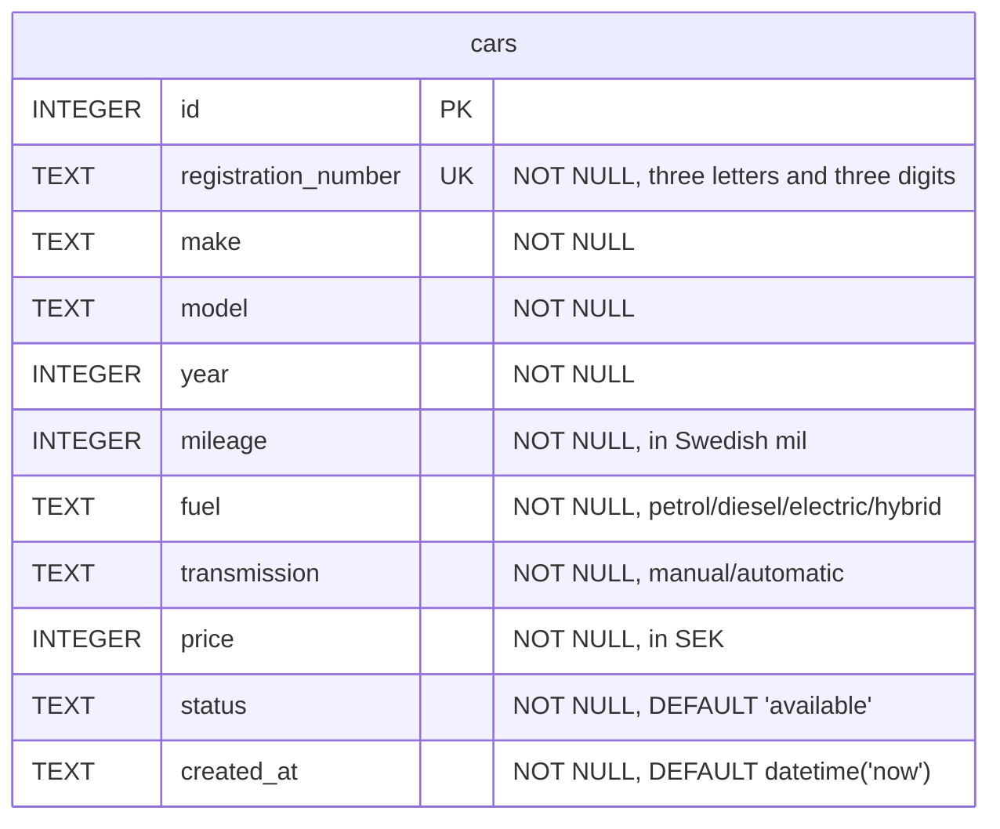

# Dealership API :car:

A REST API over a car dealership's vehicle inventory, built as an assignment for an API-development Node.js course. Cars can be listed, filtered, added, updated and removed, and each car carries a stock status: available, reserved or sold.

The assignment is API-only, so there is no frontend. The interactive documentation at `/docs` is the intended way to explore it.

## Tech stack

Node.js, Express 5, better-sqlite3. Tested with Vitest and Supertest. Documented with OpenAPI, generated from JSDoc comments by swagger-jsdoc and rendered with Scalar.

## Database design



`mileage` is stored in Swedish mil, not kilometres. A car with `8500` mileage has driven 85 000 km.

## Getting started

### Prerequisites

- [Node.js](https://nodejs.org/en/download) (latest LTS recommended)
- npm (included with Node.js)

Verify with `node -v` and `npm -v`.

### Installation

```bash
git clone https://github.com/vuoalex/dealership-api.git
cd dealership-api
npm install
cp .env.example .env
```

### Seed the database

```bash
npm run seed
```

Creates `cars.db` and fills it with 50 generated cars. Without it the API works, but every list is empty. Running it again replaces the existing rows.

### Start the server

```bash
npm run dev
```

Runs on http://localhost:3000. Open http://localhost:3000/docs for the interactive documentation, where every endpoint can be tried against the running server.

`npm start` runs the same server without file watching.

## API

Base path: `/api/cars`

| Method | Path | Description |
|---|---|---|
| GET | `/api/cars` | List all cars, paginated |
| GET | `/api/cars/:id` | Get a single car |
| GET | `/api/cars/status/:status` | List cars by stock status |
| GET | `/api/cars/make/:make` | List cars by make, case-insensitive |
| POST | `/api/cars` | Add a car |
| PUT | `/api/cars/:id` | Replace a car |
| DELETE | `/api/cars/:id` | Remove a car |

Errors are returned as `{ "error": "message" }` — 400 for invalid input, 404 when a car does not exist, 409 when a registration number is already in use.

`GET /api/cars` is paginated: `page` defaults to 1 and `limit` to 10, with a maximum of 100.

Example:
```
GET /api/cars?page=2&limit=3
```

Full request and response details are in `/docs`.

## Testing and TDD

```bash
npm test
```

The API was built test-first, following red-green-refactor, so the history shows a failing test committed before the code that makes it pass.

Tests run against an in-memory database set by `vitest.config.js` and never touch `cars.db`.

## Project structure

```
dealership-api/
├── src/
│   ├── config/        database connection, environment, OpenAPI definition
│   ├── controllers/   thin request handlers
│   ├── middleware/    centralised error handling
│   ├── routes/        route definitions and OpenAPI comments
│   ├── services/      business logic and database queries
│   ├── utils/         AppError, input validation
│   ├── app.js         the Express app, without listen
│   └── server.js      starts the server
├── scripts/
│   └── seed.js        generates and inserts sample data
└── tests/
    └── cars.test.js   endpoint tests
```
